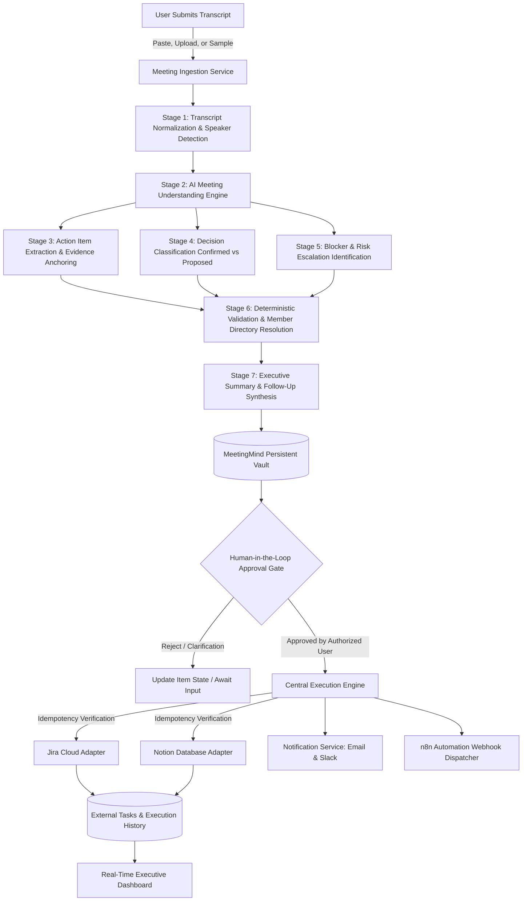

# MeetingMind AI

> **Production Agentic AI System** transforming unstructured meeting transcripts into verified decisions, assignees, and automated Jira and Notion tasks with mandatory human-in-the-loop review.

---

## 1. System Architecture

---

## 2. Key Features

- **Multi-Stage AI Analysis Pipeline:**
  - Speaker label parsing, timestamp recognition, and whitespace normalization.
  - Zero-hallucination extraction: Decisions are distinguished as confirmed vs proposed; missing owners or deadlines are flagged rather than fabricated.
  - Evidence quotes linking each extracted deliverable directly to spoken transcript quotes.
  - Deterministic person resolution matching against the workspace member directory (email &rarr; display name &rarr; configured alias &rarr; fuzzy suggestion with strict threshold &rarr; unassigned).
- **Mandatory Human-in-the-Loop Verification:**
  - Unapproved actions **never execute**.
  - Review screen with inline editing (title, description, assignee, deadline, priority, destination system).
  - Invalidation safety: Editing an approved action immediately invalidates previous approval, requiring re-approval.
  - Single and bulk approval workflows for verified deliverables.
- **Enterprise Integrations with Dual-Destination Resilience:**
  - **Jira Cloud REST API:** Creates rich issues formatted in Atlassian Document Format (ADF) with evidence quotes, priority, assignees, and acceptance criteria.
  - **Notion Database API:** Dynamically maps page properties (Title, Status, Priority, Due Date) with block-level evidence quotes.
  - **Independent Destination Recovery:** If Jira succeeds and Notion fails, only Notion is retried upon restart—guaranteeing zero duplicate Jira issues.
- **n8n Automation Layer:**
  - 4 import-ready workflow definitions in `automation/workflows/`.
  - Secure webhook HMAC/secret signatures.
  - Scheduled daily reminder digests and failure alerting.
- **Automated Test Runner:**
  - 10+ unit and integration test suites executable directly in the UI under **Automated Tests** or via API (`POST /api/v1/tests/run`).

---

## 3. Quickstart & Local Setup

### Prerequisites
- Node.js 20+
- npm or pnpm

### Installation
\`\`\`bash
# 1. Clone repository
git clone https://github.com/your-org/meetingmind-ai.git
cd meetingmind-ai

# 2. Install dependencies
npm install

# 3. Configure environment variables
cp .env.example .env

# 4. Start full-stack development server (Express backend + Vite frontend on port 3000)
npm run dev
\`\`\`

The app will be available at: **`http://localhost:3000`**

---

## 4. Preloaded Demo Mode & Samples

MeetingMind AI includes **high-fidelity demo mode** out of the box requiring zero external credentials:

- **Demo Workspace:** Acme Cloud Platform (Lead: Sarah Chen)
- **Known Members:** Alex Rivera, Priya Patel, Marcus Vance, Elena Rostova
- **Sample Transcripts (1-Click Load in UI):**
  1. *Sprint 42 Architecture & Cloud Migration Sync* (Database cutover, auth blockers, failover testing)
  2. *Q4 Product Roadmap & Enterprise Features Sync* (Enterprise SAML SSO, Notion sync limits)
  3. *Sev-1 Incident Post-Mortem: API Gateway Outage* (Redis connection pool starvation root cause analysis)

---

## 5. Live Mode Configuration

To enable live external providers, configure the following in `.env`:

### Gemini 3.8 Flash AI Provider
\`\`\`bash
AI_PROVIDER=gemini
GEMINI_MODEL=gemini-3.8-flash
GEMINI_API_KEY=your-gemini-api-key
\`\`\`

### Jira Cloud
\`\`\`bash
JIRA_BASE_URL=https://your-domain.atlassian.net
JIRA_USER_EMAIL=admin@your-domain.com
JIRA_API_TOKEN=your-atlassian-api-token
JIRA_DEFAULT_PROJECT_KEY=PROJ
\`\`\`

### Notion
\`\`\`bash
NOTION_API_KEY=secret_your-notion-internal-integration-token
NOTION_DEFAULT_DATABASE_ID=your-32-char-database-id
\`\`\`

---

## 6. Running Automated Tests

Run the built-in test suite:
- Navigate to the **Automated Tests** tab in the web UI and click **Run All Test Suites (10+)**.
- Or via curl:
\`\`\`bash
curl -X POST http://localhost:3000/api/v1/tests/run
\`\`\`

Asserts:
- Transcript normalization & speaker parsing
- Exact email, display name, and alias owner resolution
- Date resolution & ambiguity flagging
- Human approval guard enforcement
- Approval invalidation on payload edit
- Idempotency & duplicate prevention
- Dual destination resilience (Jira + Notion)

---

## 7. License

MIT &bull; MeetingMind AI Enterprise Systems
