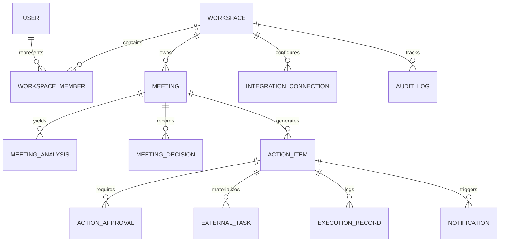

# Database Schema Specification

The MeetingMind AI relational database schema is normalized to guarantee tenant isolation, auditability, and execution idempotency.

---

## Table Specifications

### 1. `users`
- `id` (VARCHAR PK): Unique identifier (`usr-...`)
- `name` (VARCHAR): Full name
- `email` (VARCHAR UNIQUE): Case-insensitive email
- `password_hash` (VARCHAR): Salted PBKDF2-SHA512 hash
- `role` (VARCHAR): Global role (`owner`, `admin`, `member`)
- `created_at` (TIMESTAMP): UTC creation time

### 2. `workspaces`
- `id` (VARCHAR PK): Workspace identifier (`ws-...`)
- `name` (VARCHAR): Workspace name
- `timezone` (VARCHAR): IANA timezone string (e.g. `America/Los_Angeles`)
- `settings` (JSON): Destination preferences, notification flags, and AI provider selection

### 3. `workspace_members`
- `id` (VARCHAR PK): Member identifier (`mem-...`)
- `workspace_id` (VARCHAR FK -> workspaces.id)
- `user_id` (VARCHAR FK -> users.id)
- `display_name` (VARCHAR): Known name for speech attribution
- `email` (VARCHAR): Contact email for assignment alerts
- `aliases` (JSON Array): Known aliases (e.g. `["Alex", "arivera", "Al"]`)
- `role` (VARCHAR): Workspace RBAC role (`owner`, `admin`, `member`)

### 4. `meetings`
- `id` (VARCHAR PK): Meeting identifier (`mtg-...`)
- `workspace_id` (VARCHAR FK -> workspaces.id)
- `title` (VARCHAR): Title of meeting
- `meeting_date` (DATE): Calendar anchor date (YYYY-MM-DD)
- `source_type` (VARCHAR): `paste`, `upload`, or `sample`
- `transcript_text` (TEXT): Verbatim transcript dialogue
- `transcript_hash` (VARCHAR): SHA-256 integrity hash
- `processing_status` (VARCHAR): `draft`, `queued`, `processing`, `needs_review`, `completed`, `failed`

### 5. `action_items`
- `id` (VARCHAR PK): Action identifier (`act-...`)
- `meeting_id` (VARCHAR FK -> meetings.id)
- `analysis_version` (INT): Version number of extraction run
- `title` (VARCHAR): Action item summary
- `description` (TEXT): Detailed requirements
- `owner_member_id` (VARCHAR NULLABLE FK -> workspace_members.id)
- `stated_owner` (VARCHAR): Literal speaker utterance
- `due_date` (DATE NULLABLE): Target deadline
- `deadline_basis` (VARCHAR): `explicit`, `inferred`, or `unknown`
- `priority` (VARCHAR): `high`, `medium`, `low`
- `status` (VARCHAR): `pending_review`, `approved`, `rejected`, `flagged_clarification`
- `evidence` (JSON): Quote, speaker, timestamp
- `ambiguity_flags` (JSON Array): List of missing details
- `clarification_questions` (JSON Array): Questions for review
- `target_destinations` (JSON Array): `["jira"]`, `["notion"]`, or `["jira", "notion"]`
- `approved_version` (INT NULLABLE): Version number when approval was granted

### 6. `external_tasks`
- `id` (VARCHAR PK): Task tracking identifier
- `action_item_id` (VARCHAR FK -> action_items.id)
- `workspace_id` (VARCHAR FK -> workspaces.id)
- `provider` (VARCHAR): `jira` or `notion`
- `external_id` (VARCHAR): Provider ticket ID or page UUID
- `external_key` (VARCHAR NULLABLE): Human-readable ticket key (e.g. `PROJ-104`)
- `external_url` (VARCHAR): Direct link to ticket/page
- `idempotency_key` (VARCHAR UNIQUE): Prevention token

### 7. `execution_records`
- `id` (VARCHAR PK): Execution audit identifier
- `action_item_id` (VARCHAR FK -> action_items.id)
- `provider` (VARCHAR): `jira`, `notion`, `email`, `slack`, `n8n`
- `execution_status` (VARCHAR): `running`, `succeeded`, `failed`
- `idempotency_key` (VARCHAR): Idempotency key
- `attempts` (INT): Attempt counter
- `request_summary` (JSON): Sanitized outbound payload
- `response_summary` (JSON NULLABLE): Provider response metadata
- `error_message` (TEXT NULLABLE): Error diagnostic
- `started_at` (TIMESTAMP)
- `completed_at` (TIMESTAMP NULLABLE)
